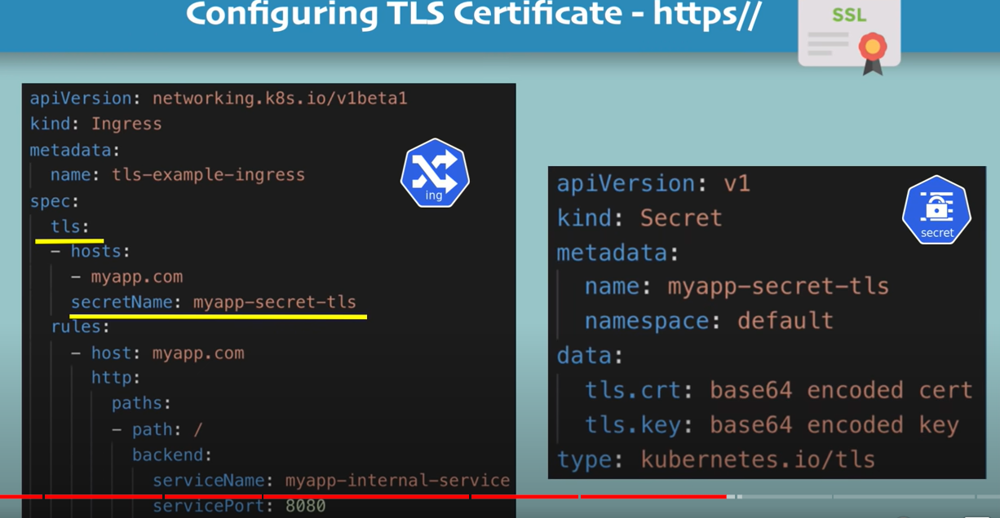
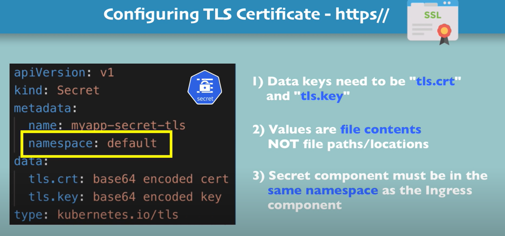

# Kubernetes-Tutorial
# Pod
- Pods are ephemeral and may only live a short time
- we can't relay on a pod ID address staying the same
- Pods can be horizontally scaled so each pod gets its own ip address
- A pod gets an ip address after it has been scheduled(no way for clients to know ip address ahead of time)

# Service

- Abstract Pod ip addresses from consumers
- Services are not ephemeral (they are not short live, they stick around)
- We use labels to associate pods with a service
- **Kube-proxy**  is responsible for creating `virtual Ip address` for services

**Service Types** 

Services can be defined in different ways:
- ClusterIP (Default type) : service can talk to internal ip address, only pods within the cluster can talk to the service.
  The service itself is just going to be used internally within the cluster and allows pods to talk to other pods
- NodePort : Expose the service on each Node's IP at a static port, allocate a port from a range (default is 30000-32767),
  Each Node proxies the allocated port
- LoadBalancer : provision an external IP to act as a load balancer for the service, exposes a service externally, useful when
  combined with a cloud provider's load balancer, `NodePort and ClusterIP services are created`
- ExternalName : Maps a service to a DNS name, acts as an alias for an external service

``kubectl get all`` => Show all components

- By default, components(pod, replicaset, deployment, configmap...) are created in a ``default namespace``
- we can define namespace in the metadata section : 
```
apiVersion: v1
kind: ConfigMap
metadata:
  name: mongodb-configmap
  namespace: my-namespace
data:
  database_url: mongodb-service

```

To install Ingress controller in Minikube we run this command :  
`minikube addons enable ingress` => Automatically starts the k8s Nginx implementation of Ingress Controller

### Configure Tls




